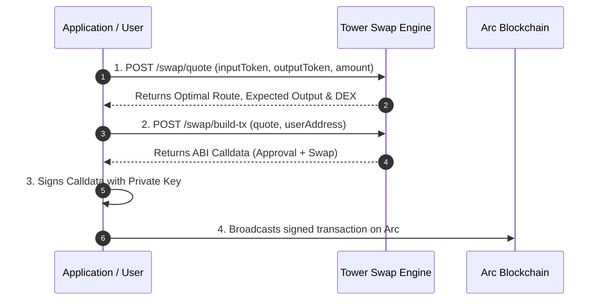

# Swap Engine

### High-Performance DEX Aggregation & Swap Execution

The Tower Swap Engine module unifies liquidity across all decentralized exchanges on the Arc blockchain (including **Synthra**, **UnitFlow**, and **Tower DEX**). It allows you to query active router deployments, compute multi-DEX optimal routes, and generate unsigned transaction payloads for on-chain execution.

---

### Swap Engine Endpoints

The Swap Engine consists of three core endpoints executed in sequence:

| Endpoint | Method | Cost | Description |
| :--- | :--- | :--- | :--- |
| [`/api/public/swap/dexes`](list-dex-routers.md) | `GET` | `1 CU` | List all supported AMM DEX routers and factory deployments. |
| [`/api/public/swap/quote`](get-swap-quote.md) | `POST` | `2 CU` | Compute the optimal routing path, output amount, and price impact. |
| [`/api/public/swap/build-tx`](build-swap-tx.md) | `POST` | `3 CU` | Build unsigned transaction calldata for ERC-20 approval and swap execution. |

---

### Execution Lifecycle

---

### Module Guides

* [List Supported DEX Routers](list-dex-routers.md)
* [Get Optimal Swap Quote](get-swap-quote.md)
* [Build Unsigned Swap Transaction](build-swap-tx.md)
