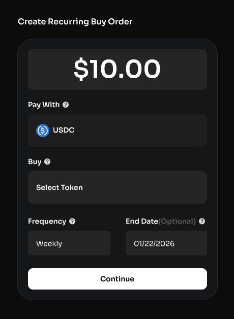
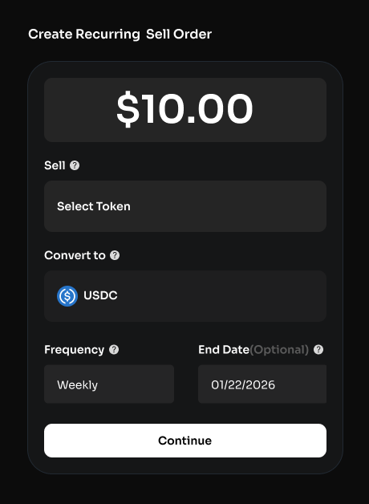
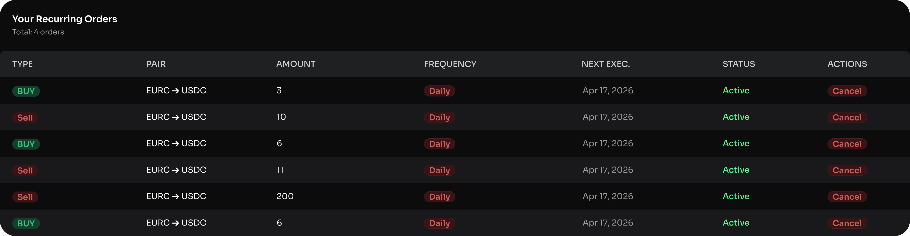

# Recurring Orders

#### What Are Recurring Orders?

Recurring Orders allow users to set up automated swaps that execute at regular intervals. Instead of manually placing the same trade repeatedly, users define the parameters once and Tower handles the rest. This is particularly useful for strategies like dollar-cost averaging (DCA), where consistent, periodic purchases help smooth out price volatility over time.

#### How use Recurring Orders

To create a Recurring **Buy** Order, users specify:

* **Input token:** The token they wish to pay with for each execution.
* **Output token:** The token being purchased on each execution.
* **Amount per order:** How much of the input token is swapped each time.
* **Frequency:** How often the order executes (e.g., hourly, daily, weekly).
* **Duration:** How long the recurring order remains active, or whether it runs indefinitely.

<figure><figcaption></figcaption></figure>

To create a Recurring **Sell** Order, users specify:

* **Input token:** The token they wish to sell on each execution.
* **Output token:** The token they wish to receive on each execution.
* **Amount per order:** How much of the input token is swapped each time.
* **Frequency:** How often the order executes (e.g., hourly, daily, weekly).
* **Duration:** How long the recurring order remains active, or whether it runs indefinitely.

<figure><figcaption></figcaption></figure>

Once configured, Tower automatically executes each swap at the scheduled interval using the same smart routing engine that powers standard swaps. Every execution finds the best available route across all integrated Arc DEXs at that moment.

#### Managing Recurring Orders

Active Recurring Orders can be viewed, or cancelled at any time from the '**View Orders**' panel. Users can click on any order to see more details.

<figure><figcaption></figcaption></figure>


Recurring Orders require sufficient input token balance in the connected wallet at the time of each scheduled execution. If the balance is insufficient, that execution will be skipped.


#### Why Use Recurring Orders?

* **Dollar-Cost Averaging:** Rather than trying to time the market with a single large purchase, users can spread their buying across multiple smaller orders over time. This reduces the risk of buying at a local price peak and averages out entry price across market fluctuations.
* **Hands-Free Trading:** Recurring Orders remove the need to return to the platform and manually execute the same trade. Once set, the orders run on schedule without further intervention.
* **Consistent Execution:** Each recurring swap benefits from Tower's routing algorithm, ensuring optimal execution on every order regardless of when it lands.
