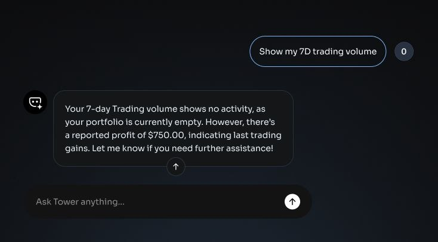

# Tower AI Assistant

#### What Is the AI Assistant?

Tower's AI assistant is a conversational interface built directly into the trading platform. It connects to on-chain data and translates it into plain-language insights. Instead of deciphering raw blockchain data manually, users can simply ask.

<figure><figcaption></figcaption></figure>

#### What Tower AI Does

The AI assistant helps with:

* **Portfolio Analysis:** Users can ask about current holdings, token allocations, and how their portfolio has changed over time. Example: _"What is my current portfolio breakdown?"_
* **Trade Executions:** Users can make swaps by simply telling the AI to do so. Example: _"swap 10$ usdc to eurc"._ (Tower AI does not have access to private keys, trades are signed and confirmed by users).
* **Trade Explanations:** The assistant provides clear explanations of past trades, including the route taken, the price received, and how it compared to market rates. Example: _"Explain my last swap"_
* **Performance Insights:** Users can understand how their trading activity has performed, whether execution has been consistently good and how much has been saved by using Tower. Example: _"How has my trading performance been this week?"_


The AI reads publicly available on-chain data. It does not have access to private keys, cannot sign transactions, and cannot move funds. Any swap made by the AI is signed by the User

